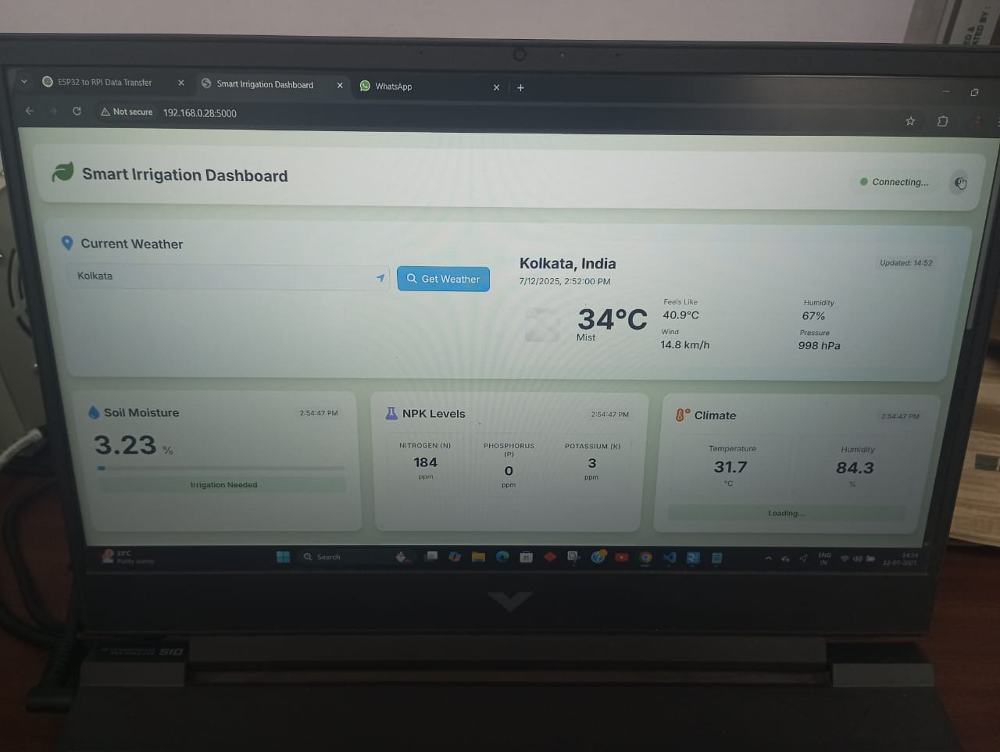
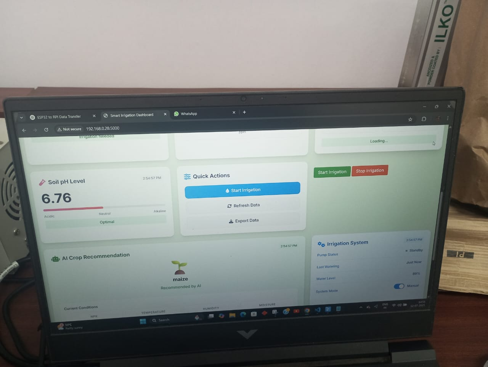
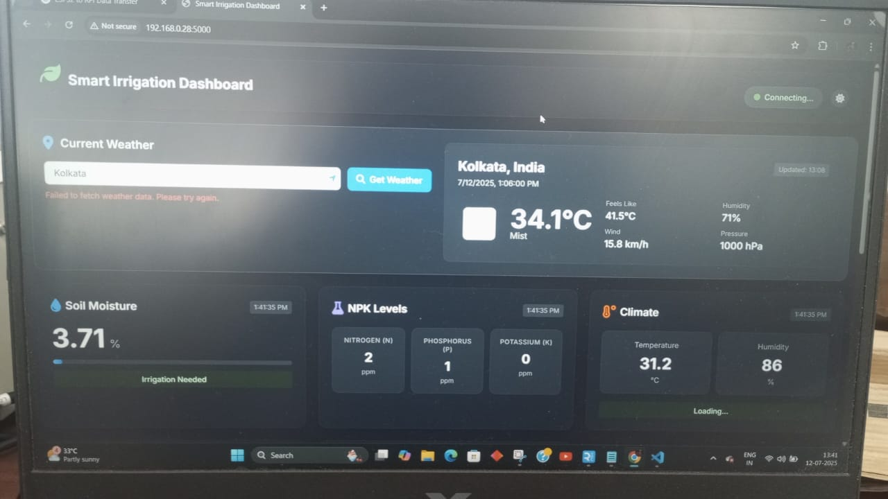
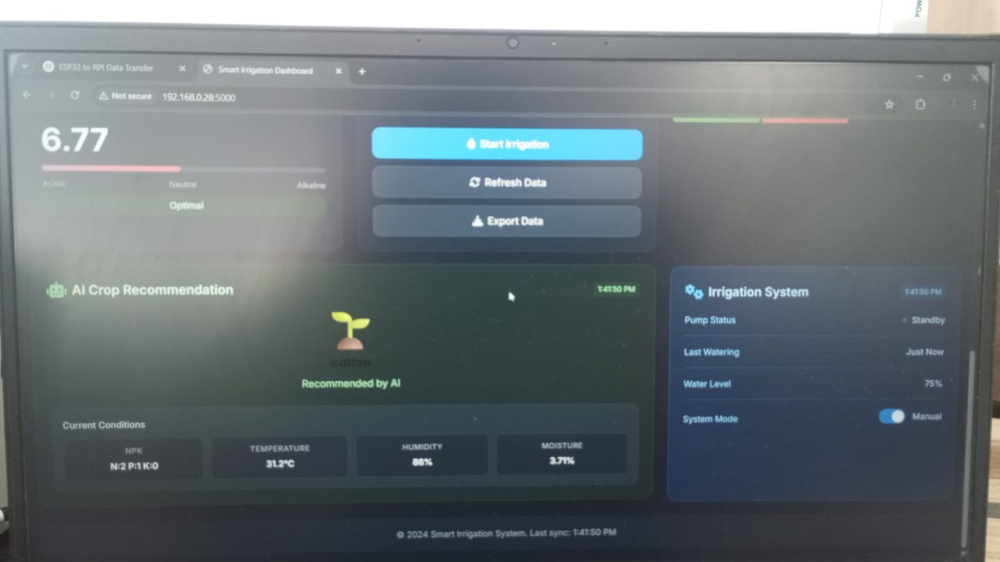
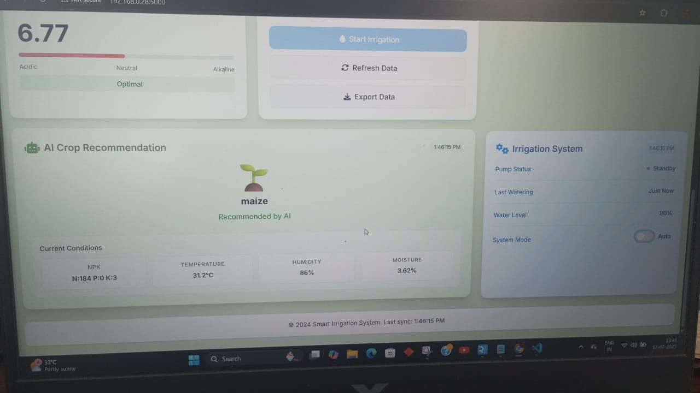

# 🌱 IoT-based Crop Predictor & Smart Irrigation System using Machine Learning

> **An end-to-end smart agriculture solution integrating IoT hardware, Raspberry Pi edge deployment, and high-accuracy Machine Learning models to optimize crop selection and water usage.**

---

## 🚀 Project Overview

This project presents a **Smart Agriculture System** designed to assist farmers in making **data-driven decisions** for crop selection and irrigation management. The system combines **real-time sensor data**, **machine learning-based predictions**, and a **web-based dashboard** to improve crop yield while conserving water.

The solution is **fully deployed on Raspberry Pi 5**, uses **IoT sensors interfaced via Arduino UNO**, and provides an intuitive **Flask-powered web application** built with modern frontend technologies.

---

## 🎥 Demo & Visuals

## 📸 System Screenshots

### 🌐 Web Dashboard Interface


### 📊 Sensor Data Montoring


### 💧 Smart Irrigation Control Panel


### 🔌 Hardware Setup (Sensors + Arduino + Raspberry Pi)


### 📡Crop Prediction Results


## 🎥 Project Demonstration Videos

🔹 **Full Working Video including setup (Model Output & Analysis)**  
👉 https://drive.google.com/file/d/1PHyTDzvVbkiZKe89s2G2fpd4NUM-jBTX/view?usp=sharing

🔹 **Real-Time Sensor Data Monitoring & Automated Irrigation Execution**  
👉 https://drive.google.com/file/d/12Pkv_oBy0GW4lDcrV2ZCDQgl8ofrkA6c/view?usp=sharing


---

## 🧠 Key Features

### 🌾 Crop Recommendation System

* Recommends the **most suitable crop** based on:

  * Soil Moisture
  * Temperature & Humidity
  * Soil pH
  * NPK (Nitrogen, Phosphorus, Potassium)
* Uses **supervised Machine Learning models** trained on real-time and curated datasets

### 💧 Smart Irrigation Automation

* Automatically controls water pump using soil moisture thresholds
* Prevents **over-irrigation and under-irrigation**
* Supports **manual and automatic modes** via web interface

### 📊 Real-Time Monitoring Dashboard

* Displays live sensor readings
* Shows irrigation status (ON/OFF)
* Provides crop prediction results

### 🖥️ Edge Computing Deployment

* Hosted entirely on **Raspberry Pi 5**
* Low-latency, offline-capable local processing

### 🔐 Software Engineering Best Practices

* Git-based version control
* Modular folder structure
* Flask MVC-style architecture

---

## 🏗️ System Architecture

```text
[ Sensors ]
     │
     ▼
[ Arduino UNO ]  →  Wi-Fi  →  [ Raspberry Pi 5 ]
                                   │
                                   ├── Flask Backend
                                   ├── ML Models (Crop & Irrigation)
                                   └── Web Dashboard (HTML, CSS, Tailwind, JS)
```

📌 **Note:** As per the research paper, **Arduino UNO** is used to interface all sensors and transmit data wirelessly to the Raspberry Pi, which acts as the central processing and hosting unit.

---

## 🧰 Hardware Components Used

* **Arduino UNO** – Sensor interfacing and data acquisition
* **Raspberry Pi 5** – Central processing unit & web server
* **DHT22 Sensor** – Temperature & Humidity
* **Capacitive Soil Moisture Sensor**
* **Soil pH Sensor**
* **NPK Sensor** – Nitrogen, Phosphorus, Potassium
* **Relay Module**
* **5V Submersible Water Pump**

---

## 🧪 Machine Learning Models & Performance

### 🌱 Crop Recommendation Models

| Algorithm     | Accuracy   |
| ------------- | ---------- |
| Random Forest | **99.80%** |
| ANN           | 99.69%     |
| KNN           | 99.67%     |
| SVM           | 99.59%     |

### 💧 Irrigation System Models

| Algorithm           | Accuracy   |
| ------------------- | ---------- |
| Random Forest       | **99.97%** |
| Logistic Regression | 95.10%     |

✔ **Random Forest selected for final deployment** due to superior handling of non-linear relationships and high generalization capability.

---

## 🧬 Tech Stack

### 🌐 Frontend

* HTML5
* CSS3
* **Tailwind CSS**
* JavaScript

### ⚙️ Backend

* **Flask (Python)**
* RESTful APIs

### 🤖 Machine Learning

* Scikit-learn
* Random Forest, SVM, KNN, ANN, Logistic Regression

### 🖥️ IoT & Deployment

* Arduino UNO
* Raspberry Pi 5
* Real-time environmental sensors

---

## 📂 Clean Project Structure

```bash
├── app.py
├── requirements.txt
├── sensor_data.json
├── README.md
├── LICENSE
│
├── ml_logic/
│   ├── crop/
│   ├── irrigation/
│   └── utils/
│
├── rpi_set/
│   ├── sensor_reader_main.py
│   ├── sensor_reader_irrigation_pump.py
│   └── esp32_or_arduino_code/
│
├── static/
│   ├── css/
│   ├── js/
│   ├── images/
│   └── videos/
│
└── templates/
```

---

## 📈 Results & Highlights

* ✔ **99.80% accuracy** in crop recommendation
* ✔ **99.97% accuracy** in irrigation automation
* ✔ Real-time decision making using live field data
* ✔ Edge-hosted, scalable architecture

---

## 🌍 Real-World Impact

* Efficient water conservation 💧
* Improved crop yield 🌾
* Reduced manual intervention 👨‍🌾
* Promotes **sustainable and precision farming**

---

## 🔮 Future Enhancements

* Integrate live weather data directly into ML models
* Support more crop varieties and soil types
* Mobile App / PWA integration
* Cloud + Edge hybrid deployment

---

## 👨‍💻 Team

* **Saptak Chaki**
* Aanchal Sinha
* Abhishek Kumar Jha
* Aiza Fatima Ahmad
* Sudipa Mondal

---

## 📜 Research Reference

**IoT based Crop Predictor and Water Irrigation System using Machine Learning**

This repository is an implementation aligned with the published research work.

## 🎬 Full Project Demonstration (Google Drive)

📁 **Complete End-to-End Working Demo**  
👉 [Watch Full Project Demo on Google Drive for our upcoming Published Research Paper](https://drive.google.com/file/d/1p4VLDbA_E4udX0YzGNThwkX9eF8iZPcN/view?usp=sharing)

---

## ⭐ Resume Highlights

✔ IoT + Machine Learning + Full Stack Project
✔ Arduino UNO & Raspberry Pi Integration
✔ Real-time Sensor Processing
✔ Research-grade Accuracy
✔ Edge Deployment Experience

---

> ⭐ *If you find this project useful, consider starring the repository!*
